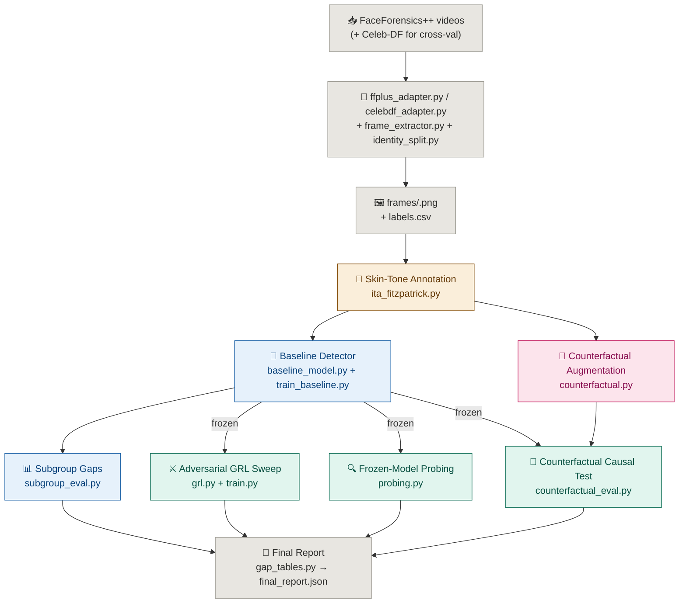

<div align="center">


# Deepfake Detection Under Skin-Tone and Lighting Variations


**Annotate it. Perturb it. Train on it. Disentangle it. Prove what actually moved the needle.**

When a deepfake detector's accuracy differs across skin-tone groups, is it actually responding to skin tone — or to illumination/color cues that merely correlate with skin tone in the training data? This codebase is a complete research pipeline built to answer that question with a real causal test, not just a subgroup accuracy table.

</div>

---

## The Problem

Deepfake detectors routinely show accuracy gaps across skin-tone subgroups, and it's tempting to stop the analysis right there.

**A subgroup gap table only tells you a gap exists.** It can't tell you *why* — the model could be genuinely reacting to skin pigmentation, or it could be reacting to lighting conditions that happen to be correlated with skin tone in the dataset, which is a very different (and very differently fixable) problem.

**Naively "de-biasing" without knowing the cause** risks training away a spurious correlate while leaving the real one untouched, or worse, degrading real detection accuracy to fix a confound that was never actually driving the gap.

---

## The Solution

This pipeline separates **measuring the gap** from **explaining the gap**, using three independent lines of evidence that all point at the same causal question:

- **Annotate** every face with a lighting-corrected skin-tone label (Individual Typology Angle → Fitzpatrick I–VI), so the ground-truth label itself isn't contaminated by illumination
- **Generate matched counterfactuals** — the same face with *only* pigmentation shifted, *only* illumination shifted, both, or neither — with an automated manipulation check that flags any shift that wasn't as clean as intended
- **Train once** a standard baseline detector and measure its subgroup accuracy/AUC/EER gaps — this is "the detector as built," never retrained for the causal test
- **Interrogate that frozen model three ways**: adversarial invariance sweeps (what does removing this signal cost?), linear probing (is this information even present in the features?), and — the headline result — running the untouched model on the counterfactual sets and measuring how much its output actually moves under a skin-tone-only vs. illumination-only perturbation
- **Report honestly**, with bootstrap confidence intervals and a permutation test comparing the two effect sizes directly, not just against zero

---

## Core Pipeline Flow

```
FaceForensics++ videos (real YouTube source + 4 manipulation methods)
        ↓
Frame/face extraction  →  video-to-still-image (frame_extractor.py)
        ↓
Dataset adapter — converts FF++'s video layout into labels.csv/annotations.csv
   (Celeb-DF: same adapter pattern, held out for cross-dataset validation only)
        ↓
Identity-safe train/val/test split (no identity straddles two splits)
        ↓
Skin-tone annotation (ITA / Fitzpatrick I–VI, illuminant-corrected)
        ↓
Counterfactual generation {original, skin_only, illum_only, both}
                          + manipulation-check validation
        ↓
Train baseline detector  →  subgroup gap tables (accuracy/AUC/EER)
        ↓
Disentangle the frozen baseline, three ways:
   adversarial GRL sweep (λ_skin, λ_illum independently)
   linear probing on frozen features
   counterfactual causal test  ←  the headline result
        ↓
Research-level validation:
   multi-seed rerun (mean ± std)  +  cross-dataset zero-shot eval on Celeb-DF
                     +  backbone ablation (EfficientNet-B4 / Xception / ViT / CLIP)
        ↓
Final report: gap tables + frontiers + probe leakage
                        + Delta_skin vs Delta_illum with bootstrap CI
                        + permutation test + plain-language conclusion
                        + LaTeX table export
```

> **Dataset:** this pipeline's primary dataset is now FaceForensics++ (previously
> AI-Face). See [`DATASET_SELECTION.md`](DATASET_SELECTION.md) for the full
> rationale. `src/data/aiface_adapter.py` still works if you want to reproduce
> the earlier AI-Face-based results.

---

## Pipeline Stages

| Stage | Module | What it does |
|---|---|---|
| **Frame/face extraction** | `src/data/frame_extractor.py` | Samples evenly-spaced frames from each FF++/Celeb-DF video and runs MTCNN face detection on each, producing the still-image face crops the rest of the pipeline expects |
| **Dataset preparation** | `src/data/ffplus_adapter.py` (primary), `src/data/celebdf_adapter.py` (cross-dataset validation, eval-only), `src/data/aiface_adapter.py` (legacy) | Converts the source dataset's schema into the shared `labels.csv`/`annotations.csv` layout the rest of the pipeline expects. See [`DATASET_SELECTION.md`](DATASET_SELECTION.md) |
| **Identity-safe splitting** | `src/data/identity_split.py` | Groups rows by a derived identity key before splitting, so the same subject/source video never appears in more than one of train/val/test |
| **Skin-tone annotation** | `src/annotation/ita_fitzpatrick.py` | Detects facial landmarks, estimates the scene illuminant and white-balance-corrects the image *before* computing skin tone, samples cheek/forehead/nose patches, converts to Lab, computes the Individual Typology Angle, and bins it into Fitzpatrick I–VI |
| **Counterfactual augmentation** | `src/augmentation/counterfactual.py` | Generates a 4-way factorial set per face (`original`, `skin_only`, `illum_only`, `both`) via classical Lab-space shifts, then re-runs each generated image through the annotation pipeline as a manipulation check, flagging any residual coupling between the two axes |
| **Baseline detector** | `src/detector/baseline_model.py`, `train_baseline.py`, `subgroup_eval.py` | Trains one standard detector (EfficientNet-B4 or Xception, swappable to ViT/CLIP via `timm`), checkpoints every epoch, tracks and saves the best validation-AUC checkpoint, and evaluates it with the full detection metric set plus accuracy/AUC/EER/TPR/FPR broken out by Fitzpatrick bin, illumination bin, and a 2D cross table. This step only establishes **that** a gap exists |
| **Disentanglement** | `src/disentangle/grl.py`, `model.py`, `losses.py`, `train.py`, `probing.py`, `counterfactual_eval.py` | Three independent tests against the *same frozen* baseline model: a Gradient-Reversal-Layer adversarial sweep over λ_skin and λ_illum independently (accuracy-vs-invariance frontiers), linear probes on frozen features (is the info even present?), and the counterfactual causal test — Delta_skin vs Delta_illum on the untouched baseline, holding identity and artifacts fixed |
| **Multi-seed validation** | `src/experiments/seed_rerunner.py` | Reruns the baseline + subgroup eval across multiple seeds (default 42/123/2024/3407/7777) and reports mean ± std for every gap metric — single-seed results aren't a publishable claim |
| **Cross-dataset validation** | `src/experiments/cross_dataset_validator.py` | Trains once on FF++, evaluates zero-shot on Celeb-DF; reports the in-domain vs out-of-domain AUC drop and both datasets' gap tables side by side |
| **Backbone ablation** | `src/experiments/backbone_ablation.py` | Sweeps EfficientNet-B4 / Xception / ViT / CLIP-RN50 and flags whether the Delta_skin vs Delta_illum finding holds regardless of architecture |
| **Final report** | `src/reports/gap_tables.py` | Aggregates everything into one JSON report: descriptive gap tables, both invariance frontiers, probe leakage numbers, and the Delta_skin vs Delta_illum comparison with bootstrap 95% CIs and a permutation test for whether the two effects differ from *each other* — plus a plain-language headline conclusion string, quotable directly in a paper's abstract/results, and a LaTeX table export (`export_latex_tables`) for the paper itself |

---

## Architecture



---

## Tech Stack

**Core**
- PyTorch + torchvision — model, training loop, EfficientNet-B4 default backbone
- `timm` — swap-in backbones: Xception, ViT, CLIP
- OpenCV — illuminant estimation, white-balance correction, Lab-space color shifts
- mediapipe (pinned `0.10.13`) — facial landmark detection for skin-tone patch sampling; `face-alignment` is a supported drop-in alternative if installed
- Pillow — image I/O for the dataset classes
- pandas / NumPy — annotation tables, subgroup aggregation
- scikit-learn — ROC-AUC, accuracy, precision/recall/F1, EER computation

**Fairness / causal machinery**
- Gradient Reversal Layer (Ganin & Lempitsky) — adversarial invariance training
- Linear probing on frozen features
- Classical Lab-space counterfactual image generation with an automated manipulation check
- Bootstrap confidence intervals + permutation testing for effect-size comparison

---

## Project Structure

```
skin_tone_deepfake/
│
├── run_pipeline.py                   # orchestrator — runs every stage end to end,
│                                      #   or any single stage via --stage
├── requirements.txt
│
└── src/
    ├── data/
    │   ├── frame_extractor.py         # video -> face-crop extraction (MTCNN),
    │   │                              #   used by ffplus/celebdf adapters
    │   ├── ffplus_adapter.py          # PRIMARY: converts FaceForensics++ videos into
    │   │                              #   labels.csv/annotations.csv
    │   ├── celebdf_adapter.py         # cross-dataset validation set (eval-only),
    │   │                              #   same schema as ffplus_adapter.py
    │   ├── aiface_adapter.py          # legacy: converts AI-Face's CSV schema into
    │   │                              #   labels.csv/annotations.csv
    │   ├── illumination_binning.py    # train-only illumination bin boundaries,
    │   │                              #   applied to val/test without leakage
    │   ├── identity_split.py          # identity-safe train/val/test split
    │   └── datasets.py                # Dataset classes + expected on-disk layout,
    │                                  #   backbone-aware preprocessing
    ├── annotation/
    │   └── ita_fitzpatrick.py         # face → landmarks → illuminant estimate →
    │                                  #   white-balance correction → ITA score →
    │                                  #   Fitzpatrick I–VI
    ├── augmentation/
    │   └── counterfactual.py          # {original, skin_only, illum_only, both}
    │                                  #   generation + manipulation-check validation
    ├── detector/
    │   ├── baseline_model.py          # backbone + real/fake head, no disentanglement —
    │                                  #   "the detector as built"
    │   ├── train_baseline.py          # training loop with per-epoch checkpointing,
    │                                  #   best-validation-AUC tracking, early stopping
    │   └── subgroup_eval.py           # full detection metrics + accuracy/AUC/EER/
    │                                  #   TPR/FPR gap tables by Fitzpatrick bin,
    │                                  #   illumination bin, and the 2D cross table
    ├── disentangle/
    │   ├── grl.py                     # Gradient Reversal Layer (Ganin & Lempitsky)
    │   ├── model.py                   # shared backbone + real/fake head + two
    │                                  #   adversarial probes (skin, illumination)
    │   ├── losses.py                  # L = L_cls − λ1·L_adv(skin) − λ2·L_adv(illum)
    │   ├── train.py                   # sweeps λ_skin and λ_illum INDEPENDENTLY to
    │                                  #   trace two separate accuracy-vs-invariance
    │                                  #   frontiers
    │   ├── probing.py                 # linear probes on the FROZEN baseline —
    │                                  #   "is this info available in the features?"
    │   └── counterfactual_eval.py     # the headline result: runs the frozen baseline
    │                                  #   on the factorial counterfactual sets and
    │                                  #   computes Delta_skin vs Delta_illum
    ├── experiments/
    │   ├── ablation_framework.py       # lambda-sweep ablation config/runner
    │   ├── seed_rerunner.py            # multi-seed rerun + mean/std aggregation
    │   ├── cross_dataset_validator.py  # train on FF++, zero-shot eval on Celeb-DF
    │   └── backbone_ablation.py        # sweep EfficientNet-B4/Xception/ViT/CLIP
    ├── reports/
    │   └── gap_tables.py              # aggregates everything into one final report
    │                                  #   with bootstrap CIs + permutation test
    │                                  #   + LaTeX table export
    └── utils/
        ├── metrics.py                 # ROC-AUC, accuracy, precision, recall, F1,
        │                              #   FPR, FNR, EER, ACER, AP, subgroup gap
        │                              #   tables, bootstrap CI, permutation test
        └── seed.py                    # reproducibility
```

---

## Dataset

Primary dataset is [FaceForensics++](https://github.com/ondyari/FaceForensics) — real YouTube source videos with four manipulation methods (Deepfakes, Face2Face, FaceSwap, NeuralTextures). [Celeb-DF (v2)](https://github.com/yuezunli/celeb-deepfakeforensics) is used as an evaluation-only cross-dataset validation set — never trained on. Both are gated releases requiring an access request; see [`DATASET_SELECTION.md`](DATASET_SELECTION.md) for the full comparison against AI-Face (the previous primary dataset), DFDC, DeeperForensics, and UADFV, and why FF++/Celeb-DF were chosen.

`src/data/ffplus_adapter.py` and `src/data/celebdf_adapter.py` extract face crops from the raw videos (`src/data/frame_extractor.py`, MTCNN-based) and convert them into this pipeline's own layout, described below. `src/data/aiface_adapter.py` is retained for anyone reproducing the earlier AI-Face-based results.

## Expected Data Layout (after running the adapter + split)

```
data_root/
├── frames/<face_id>.png                       # raw face crops
├── labels.csv                                 # columns: face_id, fake_label (0/1), split
├── annotations.csv                             # columns: face_id, ita_continuous,
│                                                #   fitzpatrick_bin, illuminant_*, flagged
├── illumination_boundaries.json                # illumination bin boundaries, computed from
│                                                #   the TRAIN split only and cached here so
│                                                #   val/test reuse them without leakage
└── counterfactuals/<face_id>/                  # written by the counterfactual stage
    ├── original.png
    ├── skin_only.png
    ├── illum_only.png
    └── both.png
```

Fitzpatrick bins are mapped to integers 0–5 (I–VI). Illumination is binned into 5 bins from the illuminant estimate, with bin boundaries computed once from the train split and cached to `illumination_boundaries.json` (`src/data/illumination_binning.py`) — val/test reuse those exact boundaries rather than being binned against their own distribution, which would leak them into a supposedly held-out signal. `src/data/datasets.py` is the only module that assumes this specific directory structure — swap it out if your storage layout differs.

---

## Run Locally

**Step 1 — Install**

```bash
pip install -r requirements.txt
```

**Step 2 — Prepare the dataset**

```bash
python -m src.data.ffplus_adapter \
    --ffpp_root /path/to/ff++ \
    --output_dir /path/to/data_root \
    --manipulation all \
    --compression c23 \
    --frames_per_video 10 \
    --sample_n 200            # optional: subsample videos for a fast first pass

python -m src.data.identity_split \
    --labels_csv /path/to/data_root/labels.csv \
    --output_csv /path/to/data_root/labels.csv \
    --group_by face_id_prefix
```

Prefer AI-Face instead? `src/data/aiface_adapter.py` still works, same shape:

```bash
python -m src.data.aiface_adapter \
    --aiface_csv /path/to/train.csv \
    --image_root /path/to/AI-Face \
    --output_dir /path/to/data_root \
    --sample_n 2000          # optional: subsample for a fast first pass
```

**Step 3 — Run the full pipeline**

```bash
python run_pipeline.py --data_root /path/to/data --stage all
```

**Or run any single stage:**

```bash
python run_pipeline.py --data_root /path/to/data --stage annotate
python run_pipeline.py --data_root /path/to/data --stage augment
python run_pipeline.py --data_root /path/to/data --stage baseline --epochs 20
python run_pipeline.py --data_root /path/to/data --stage disentangle
python run_pipeline.py --data_root /path/to/data --stage report
```

**Step 4 — Research-level validation (once the standard stages above have a `baseline_model.pt` and `final_report.json`)**

```bash
# Prepare Celeb-DF the same way, first:
python -m src.data.celebdf_adapter --celebdf_root /path/to/Celeb-DF --output_dir /path/to/celebdf_data

python run_pipeline.py --data_root /path/to/data --stage multi_seed --seeds 42 123 2024 3407 7777
python run_pipeline.py --data_root /path/to/data --stage cross_dataset --test_data_root /path/to/celebdf_data
python run_pipeline.py --data_root /path/to/data --stage backbone_ablation --backbones efficientnet_b4 xception vit_small_patch16_224
python run_pipeline.py --data_root /path/to/data --stage latex_export
```

**Step 5 — Sanity-check without a real dataset**

Each `src/*/*.py` module also has a small `__main__` smoke test, so you can sanity-check a stage on synthetic data before pointing it at real faces.

**Output:** `data_root/final_report.json` — descriptive gap tables, both accuracy-vs-invariance frontiers, probe leakage numbers, and the Delta_skin vs Delta_illum comparison with bootstrap 95% CIs and permutation-test p-value, plus a printed plain-language `headline_conclusion` string. A trained checkpoint is written to `checkpoints/best_<backbone>.pth`.

---

## Known Limitations (state these explicitly in the paper)

| Limitation | Detail |
|---|---|
| Counterfactual generator is an approximation | The classical Lab-space shifts (`shift_skin_tone`, `shift_illumination`) are fast and interpretable, but real light transport couples pigment and illumination — no such shift is perfectly orthogonal. Report `residual_illuminant_coupling_in_skin_shift` / `residual_ita_coupling_in_illum_shift` as a bounded error source. A GAN/diffusion-based backend can be swapped in (see the docstring in `counterfactual.py`) for higher fidelity at the cost of harder-to-audit leakage |
| Adversarial sweep changes the model being studied | The disentanglement stage's `train.py` frontier tells you how much accuracy invariance costs — it is not a direct causal readout of the original baseline. That's what `counterfactual_eval.py` (run on the frozen baseline) is for, and it should be the foregrounded result in the paper |
| No independent skin-tone label to validate against | Neither FF++ nor Celeb-DF ships any demographic or skin-tone label, so the auto-ITA/Fitzpatrick bin from `ita_fitzpatrick.py` is the *only* skin-tone signal — there's no ground truth to sanity-check it against (unlike AI-Face's Race-proxy fallback, which had its own conflation problems; see `DATASET_SELECTION.md`). Treat `patch_confidence`/`flagged` as the primary per-sample quality control, and consider a small manually-labeled audit sample if reviewer pushback is expected |
| Landmark detection accuracy depends on the installed backend | `detect_landmarks()` tries `face-alignment` first, falls back to mediapipe FaceMesh, and only falls back to a non-meaningful synthetic grid (with a loud warning) if neither is installed. Install `mediapipe==0.10.13` (pinned — newer releases moved landmark detection behind a separately downloaded model file) or `face-alignment` before running on real data |
| Cross-dataset validation only covers Celeb-DF | `cross_dataset_validator.py` currently supports exactly two datasets in a train/eval pair. DFDC and DeeperForensics were considered (see `DATASET_SELECTION.md`) but not adapted — extending the validator to more than one held-out dataset would strengthen the generalization claim further |

---

## Future Scope

| Item | Why |
|---|---|
| GAN/diffusion counterfactual backend | Higher-fidelity, less-coupled skin-tone and illumination shifts than the classical Lab-space approach, at the cost of harder-to-audit generation |
| DFDC / DeeperForensics as additional cross-dataset validation | `DATASET_SELECTION.md` scoped these out of the current round for size/complexity reasons, not because they wouldn't strengthen the generalization claim |
| Per-frame → per-video aggregation | Current identity-level aggregation (`aggregate_by_identity`) is a good start; extending it to full per-video temporal aggregation would tighten the bootstrap CIs further |
