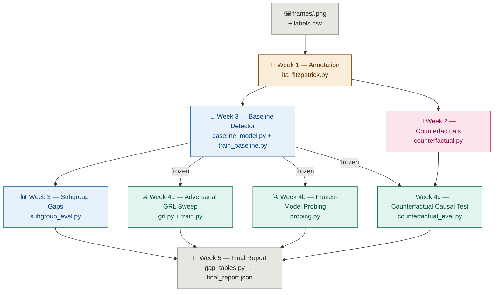

<div align="center">


# Deepfake Detection Under Skin-Tone and Lighting Variations

**Annotate it. Perturb it. Train on it. Disentangle it. Prove what actually moved the needle.**

When a deepfake detector's accuracy differs across skin-tone groups, is it actually responding to skin tone — or to illumination/color cues that merely correlate with skin tone in the training data? This codebase is a complete, 5-stage research pipeline built to answer that question with a real causal test, not just a subgroup accuracy table.

</div>

---

## The Problem

Deepfake detectors routinely show accuracy gaps across skin-tone subgroups, and it's tempting to stop the analysis right there.

**A subgroup gap table only tells you a gap exists.** It can't tell you *why* — the model could be genuinely reacting to skin pigmentation, or it could be reacting to lighting conditions that happen to be correlated with skin tone in the dataset, which is a very different (and very differently fixable) problem.

**Naively "de-biasing" without knowing the cause** risks training away a spurious correlate while leaving the real one untouched, or worse, degrading real detection accuracy to fix a confound that was never actually driving the gap.

---

## The Solution

This pipeline separates **measuring the gap** from **explaining the gap**, using three independent lines of evidence that all point at the same causal question:

- **Annotate** every face with a lighting-corrected skin-tone label (Individual Typology Angle → Fitzpatrick I–VI), so the ground-truth label itself isn't contaminated by illumination
- **Generate matched counterfactuals** — the same face with *only* pigmentation shifted, *only* illumination shifted, both, or neither — with an automated manipulation check that flags any shift that wasn't as clean as intended
- **Train once** a standard baseline detector and measure its subgroup accuracy/AUC/EER gaps — this is "the detector as built," never retrained for the causal test
- **Interrogate that frozen model three ways**: adversarial invariance sweeps (what does removing this signal cost?), linear probing (is this information even present in the features?), and — the headline result — running the untouched model on the counterfactual sets and measuring how much its output actually moves under a skin-tone-only vs. illumination-only perturbation
- **Report honestly**, with bootstrap confidence intervals and a permutation test comparing the two effect sizes directly, not just against zero

---

## Core Pipeline Flow

```
frames/<face_id>.png
        ↓
Week 1 — ITA/Fitzpatrick annotation (illuminant-corrected)
        ↓
Week 2 — counterfactual generation {original, skin_only, illum_only, both}
                          + manipulation-check validation
        ↓
Week 3 — train baseline detector  →  subgroup gap tables (accuracy/AUC/EER)
        ↓
Week 4 — disentangle the frozen baseline, three ways:
   adversarial GRL sweep (λ_skin, λ_illum independently)
   linear probing on frozen features
   counterfactual causal test  ←  the headline result
        ↓
Week 5 — final report: gap tables + frontiers + probe leakage
                        + Delta_skin vs Delta_illum with bootstrap CI
                        + permutation test + plain-language conclusion
```

---

## Pipeline Stages

| Stage | Module | What it does |
|---|---|---|
| **Week 1 — Annotate** | `src/annotation/ita_fitzpatrick.py` | Estimates the scene illuminant, white-balance-corrects the image *before* computing skin tone, samples cheek/forehead/nose patches, converts to Lab, computes the Individual Typology Angle, and bins it into Fitzpatrick I–VI. `detect_landmarks()` is a placeholder stub so the module runs standalone — swap in a real 68/98-point face-alignment model before running on real data |
| **Week 2 — Augment** | `src/augmentation/counterfactual.py` | Generates a 4-way factorial set per face (`original`, `skin_only`, `illum_only`, `both`) via classical Lab-space shifts, then re-runs each generated image through the Week 1 pipeline as a manipulation check, flagging any residual coupling between the two axes |
| **Week 3 — Baseline** | `src/detector/baseline_model.py`, `train_baseline.py`, `subgroup_eval.py` | Trains one standard detector (EfficientNet-B4 by default; swappable to Xception, ViT, or CLIP backbones via `timm`) and evaluates it with accuracy/AUC/EER broken out by Fitzpatrick bin, illumination bin, and a 2D cross table. This step only establishes **that** a gap exists |
| **Week 4 — Disentangle** | `src/disentangle/grl.py`, `model.py`, `losses.py`, `train.py`, `probing.py`, `counterfactual_eval.py` | Three independent tests against the *same frozen* Week 3 model: a Gradient-Reversal-Layer adversarial sweep over λ_skin and λ_illum independently (accuracy-vs-invariance frontiers), linear probes on frozen features (is the info even present?), and the counterfactual causal test — Delta_skin vs Delta_illum on the untouched baseline, holding identity and artifacts fixed |
| **Week 5 — Report** | `src/reports/gap_tables.py` | Aggregates everything into one JSON report: descriptive gap tables, both invariance frontiers, probe leakage numbers, and the Delta_skin vs Delta_illum comparison with bootstrap 95% CIs and a permutation test for whether the two effects differ from *each other* — plus a plain-language headline conclusion string, quotable directly in a paper's abstract/results |

---

## Architecture



---

## Tech Stack

**Core**
- PyTorch + torchvision — model, training loop, EfficientNet-B4 default backbone
- `timm` (optional) — swap-in backbones: Xception, ViT, CLIP
- OpenCV — illuminant estimation, white-balance correction, Lab-space color shifts
- Pillow — image I/O for the dataset classes
- pandas / NumPy — annotation tables, subgroup aggregation
- scikit-learn — ROC-AUC, accuracy, EER computation

**Fairness / causal machinery**
- Gradient Reversal Layer (Ganin & Lempitsky) — adversarial invariance training
- Linear probing on frozen features
- Classical Lab-space counterfactual image generation with an automated manipulation check
- Bootstrap confidence intervals + permutation testing for effect-size comparison

**Optional**
- `face-alignment` — drop-in replacement for the placeholder `detect_landmarks()` stub

---

## Project Structure

```
skin_tone_deepfake/
│
├── run_pipeline.py                   # orchestrator — runs all 5 weeks end to end,
│                                      #   or any single stage via --stage
├── requirements.txt
│
└── src/
    ├── annotation/                    # WEEK 1
    │   └── ita_fitzpatrick.py         # face → illuminant estimate → white-balance
    │                                  #   correction → ITA score → Fitzpatrick I–VI
    ├── augmentation/                  # WEEK 2
    │   └── counterfactual.py          # {original, skin_only, illum_only, both}
    │                                  #   generation + manipulation-check validation
    ├── detector/                      # WEEK 3
    │   ├── baseline_model.py          # backbone + real/fake head, no disentanglement —
    │                                  #   "the detector as built"
    │   ├── train_baseline.py          # standard training loop
    │   └── subgroup_eval.py           # accuracy/AUC/EER gap tables by Fitzpatrick bin,
    │                                  #   illumination bin, and the 2D cross table
    ├── disentangle/                   # WEEK 4
    │   ├── grl.py                     # Gradient Reversal Layer (Ganin & Lempitsky)
    │   ├── model.py                   # shared backbone + real/fake head + two
    │                                  #   adversarial probes (skin, illumination)
    │   ├── losses.py                  # L = L_cls − λ1·L_adv(skin) − λ2·L_adv(illum)
    │   ├── train.py                   # sweeps λ_skin and λ_illum INDEPENDENTLY to
    │                                  #   trace two separate accuracy-vs-invariance
    │                                  #   frontiers
    │   ├── probing.py                 # linear probes on the FROZEN baseline —
    │                                  #   "is this info available in the features?"
    │   └── counterfactual_eval.py     # the headline result: runs the frozen baseline
    │                                  #   on Week 2's factorial sets and computes
    │                                  #   Delta_skin vs Delta_illum
    ├── reports/                       # WEEK 5
    │   └── gap_tables.py              # aggregates everything into one final report
    │                                  #   with bootstrap CIs + permutation test
    ├── data/
    │   └── datasets.py                # Dataset classes + expected on-disk layout
    └── utils/
        ├── metrics.py                 # EER, subgroup gap tables, bootstrap CI,
        │                              #   permutation test
        └── seed.py                    # reproducibility
```

---

## Expected Data Layout

```
data_root/
├── frames/<face_id>.png                       # raw face crops
├── labels.csv                                 # columns: face_id, fake_label (0/1)
├── annotations.csv                             # written by Week 1
│                                                # columns: face_id, ita_continuous,
│                                                #   fitzpatrick_bin, illuminant_*, flagged
└── counterfactuals/<face_id>/                  # written by Week 2
    ├── original.png
    ├── skin_only.png
    ├── illum_only.png
    └── both.png
```

Fitzpatrick bins are mapped to integers 0–5 (I–VI); illumination is quantile-binned into 5 bins from the illuminant estimate at load time. `src/data/datasets.py` is the only module that assumes this specific directory structure — swap it out if your storage layout differs.

---

## Run Locally

**Step 1 — Install**

```bash
pip install -r requirements.txt

# optional, only if you switch backbones in build_backbone():
pip install timm

# optional, only if you swap in a real landmark detector:
pip install face-alignment
```

**Step 2 — Run the full pipeline**

```bash
# expects data_root/frames/<face_id>.png and data_root/labels.csv to exist already
python run_pipeline.py --data_root /path/to/data --stage all
```

**Or run any single stage:**

```bash
python run_pipeline.py --data_root /path/to/data --stage annotate
python run_pipeline.py --data_root /path/to/data --stage augment
python run_pipeline.py --data_root /path/to/data --stage baseline --epochs 20
python run_pipeline.py --data_root /path/to/data --stage disentangle
python run_pipeline.py --data_root /path/to/data --stage report
```

**Step 3 — Sanity-check without a real dataset**

Each `src/*/*.py` module also has a small `__main__` smoke test, so you can sanity-check a stage on synthetic data before pointing it at real faces.

**Output:** `data_root/final_report.json` — descriptive gap tables, both accuracy-vs-invariance frontiers, probe leakage numbers, and the Delta_skin vs Delta_illum comparison with bootstrap 95% CIs and permutation-test p-value, plus a printed plain-language `headline_conclusion` string.

---

## Known Limitations (state these explicitly in the paper)

| Limitation | Detail |
|---|---|
| Counterfactual generator is an approximation | The classical Lab-space shifts (`shift_skin_tone`, `shift_illumination`) are fast and interpretable, but real light transport couples pigment and illumination — no such shift is perfectly orthogonal. Report `residual_illuminant_coupling_in_skin_shift` / `residual_ita_coupling_in_illum_shift` as a bounded error source. A GAN/diffusion-based backend can be swapped in (see the docstring in `counterfactual.py`) for higher fidelity at the cost of harder-to-audit leakage |
| Adversarial sweep changes the model being studied | Week 4's `train.py` frontier tells you how much accuracy invariance costs — it is not a direct causal readout of the original baseline. That's what `counterfactual_eval.py` (run on the frozen baseline) is for, and it should be the foregrounded result in the paper |
| Landmark detection is a placeholder | `detect_landmarks()` in `ita_fitzpatrick.py` is a stub so the module runs standalone. Swap in a real 68/98-point face-alignment model (e.g. `face-alignment`) before running on real data — see the docstring for the drop-in |

---

## Future Scope

| Item | Why |
|---|---|
| Real face-alignment model | Replace the `detect_landmarks()` stub so ITA patches are sampled from genuine cheek/forehead/nose landmarks instead of a placeholder |
| GAN/diffusion counterfactual backend | Higher-fidelity, less-coupled skin-tone and illumination shifts than the classical Lab-space approach, at the cost of harder-to-audit generation |
| Multi-dataset validation | Run the full pipeline across more than one deepfake corpus to check whether Delta_skin vs Delta_illum findings generalize or are dataset-specific |
| Backbone ablation | Repeat Weeks 3–5 across EfficientNet-B4, Xception, ViT, and CLIP to see whether the causal finding is backbone-dependent |
| Per-frame → per-video aggregation | Current identity-level aggregation (`aggregate_by_identity`) is a good start; extending it to full per-video temporal aggregation would tighten the bootstrap CIs further |
