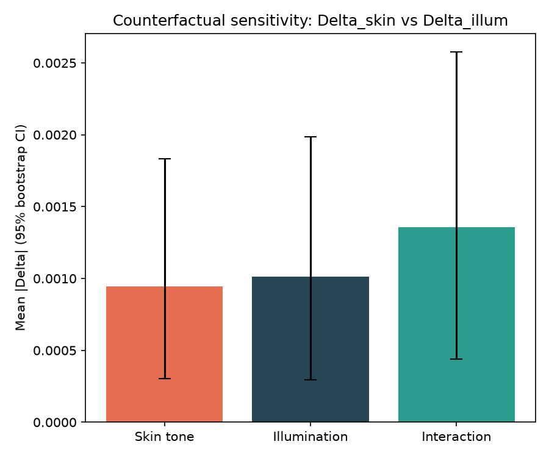
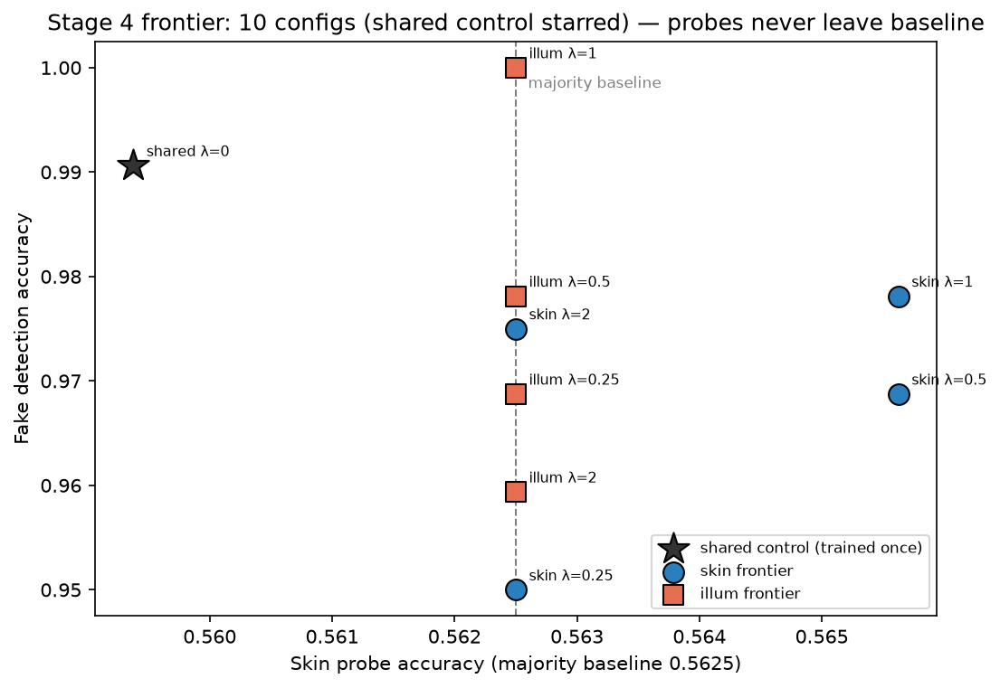
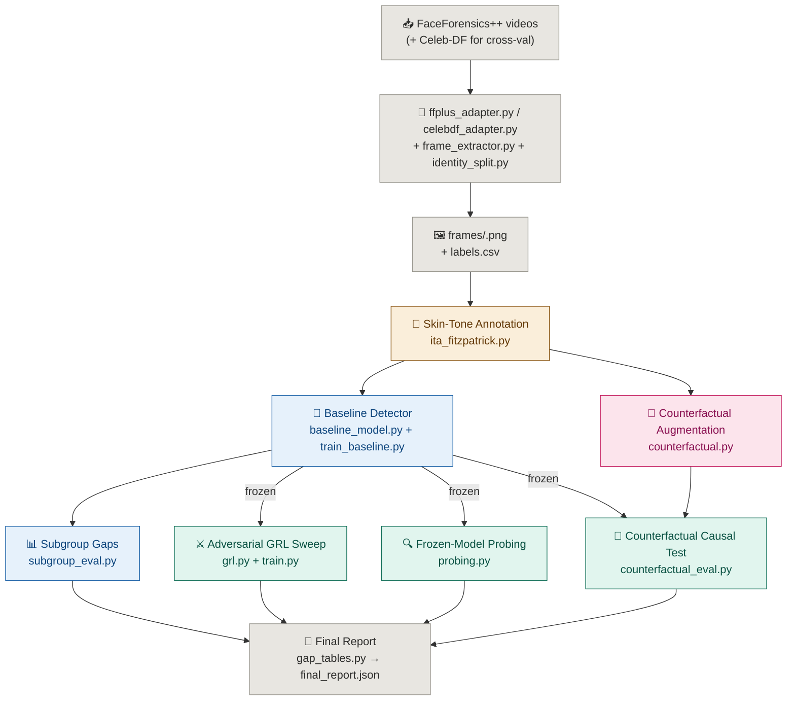

<div align="center">


# Deepfake Detection Under Skin-Tone and Lighting Variations

**Annotate it. Perturb it. Train on it. Disentangle it. Test what actually moved the needle.**

When a deepfake detector's accuracy differs across skin-tone groups, is it actually responding to skin tone, or to illumination/color cues that merely correlate with skin tone in the training data? This codebase is a research pipeline built to answer that question with a counterfactual test, not just a subgroup accuracy table.

</div>

> **Status: single-seed pilot.** The results in [`OUTPUT/`](OUTPUT/) come from one run (seed 42) on a
> **Deepfakes-only** subset of FaceForensics++ (2,660 frames: 2,400 real / 260 fake). The test split holds
> only **10 fake frames** (9 in Fitzpatrick group I, 1 in group V), and the baseline is near ceiling
> (AUC 0.994). The pipeline is complete and runs end to end; the evidence it has produced so far is a pilot
> and should not be read as a general finding about deepfake detectors. See [Known Limitations](#known-limitations).

---

## The Problem

Deepfake detectors routinely show accuracy gaps across skin-tone subgroups, and it's tempting to stop the analysis right there.

**A subgroup gap table only tells you a gap exists.** It can't tell you *why*. The model could be reacting to skin pigmentation, or to lighting conditions that happen to be correlated with skin tone in the dataset. Those are very different (and very differently fixable) problems.

**Naively "de-biasing" without knowing the cause** risks training away a spurious correlate while leaving the real one untouched, or degrading real detection accuracy to fix a confound that was never driving the gap.

---

## The Approach

The pipeline separates **measuring the gap** from **explaining the gap**, using three independent lines of evidence aimed at the same causal question:

- **Annotate** every face with a lighting-corrected skin-tone label (Individual Typology Angle → Fitzpatrick I–VI), so the label itself isn't contaminated by illumination
- **Generate matched counterfactuals**: the same face with *only* pigmentation shifted, *only* illumination shifted, both, or neither, with an automated manipulation check that rejects any shift that wasn't as clean as intended
- **Train once** a standard baseline detector and measure its subgroup accuracy/AUC/EER gaps. This is "the detector as built" and is never retrained for the causal test
- **Interrogate that frozen model three ways**: adversarial invariance sweeps (what does removing this signal cost?), linear probing (is this information present in the features?), and the headline test, which runs the untouched model on the counterfactual sets and measures how much its output moves under a skin-tone-only vs. illumination-only perturbation
- **Report with uncertainty**: bootstrap confidence intervals, plus a paired permutation test comparing the two effect sizes directly (not just each against zero)

---

## Results (pilot run)

All numbers below are read from the files in [`OUTPUT/`](OUTPUT/). Single seed (42), EfficientNet-B4, FaceForensics++ Deepfakes only.

| Item | Result | Source file |
|---|---|---|
| Dataset | 2,660 frames (2,400 real / 260 Deepfakes); train 1,980 / val 320 / test 360; 25 flagged frames excluded | `week3_metric_report.json` |
| Baseline detector (test, n=357) | AUC **0.994**, EER **0.010**, accuracy 0.986, fake-class recall 0.60 | `week3_metric_report.json` |
| Subgroup gap | TPR gap 0.44 (group I recall 0.56 on 9 fakes vs. group V recall 1.0 on 1 fake); 95% CI on group I recall [0.22, 0.89]; the gap CI spans zero | `tpr_gap_uncertainty.json` |
| Counterfactual validation | 2,577 of 2,660 accepted, 83 rejected (3.1%); 80 of the rejections were `illum_only` shifts that leaked into ITA | `counterfactual_validation_summary.json` |
| **Causal test** (frozen baseline) | mean \|ΔAUC\| skin = **0.00094**, illumination = **0.00101**; paired permutation p = **0.882**, Cohen's d = −0.003. No detectable difference between the two effects | `final_report.json`, `statistical_validation_report.json` |
| Adversarial sweep | 10 configurations (9 trained runs; the λ=0/0 control is shared), 15 epochs each; fake-class accuracy 0.95–1.00 across all λ | `week4_results_summary_solo.json` |
| Linear probing | Skin-probe accuracy sits at ~0.56 in every configuration and shows ~0 leakage above baseline; illumination probe ~0.16–0.22 (5 bins, so chance is 0.20) | `above_baseline_leakage.json`, `probe_controlled_report.json` |

**How to read this.** Both counterfactual effects are on the order of 0.001 AUC, so the baseline is effectively insensitive to *both* perturbations on this data. That is a statement about this saturated model and this small sample. It is not evidence that skin tone or lighting is irrelevant to deepfake detection in general. Stronger claims need the multi-seed and broader-data runs listed under [What has and hasn't been run](#what-has-and-hasnt-been-run).

<div align="center">




<sub>Left: counterfactual effect sizes (skin vs. illumination). Right: accuracy-vs-invariance sweep.</sub>

</div>

### What has and hasn't been run

| Component | Code | Results in this repo |
|---|---|---|
| Annotation → counterfactuals → baseline → disentanglement → report (stages 1–5) | Yes | **Yes**, single seed |
| Multi-seed replication (`seed_rerunner.py`) | Yes | **No** |
| Cross-dataset zero-shot eval on Celeb-DF (`cross_dataset_validator.py`) | Yes | **No** |
| Backbone ablation: Xception / ViT / CLIP (`backbone_ablation.py`) | Yes | **No** |
| Face2Face / FaceSwap / NeuralTextures manipulations | Adapter supports `--manipulation all` | **No** (Deepfakes only) |

### Contents of `OUTPUT/`

| File / folder | What it is |
|---|---|
| `final_report.json` | Aggregated report: gap tables, both frontiers, probe leakage, Δskin vs Δillum, headline conclusion |
| `statistical_validation_report.json` | Pre-specified test plan: CIs, p-values, effect sizes, Bonferroni-corrected decisions |
| `week3_metric_report.json`, `baseline_metrics.csv`, `subgroup_metrics.csv`, `subgroup_results.json` | Baseline detector metrics, overall and by subgroup |
| `week4_results_summary_solo.json`, `disentanglement_result_report_solo.json`, `stage4_pilot_provenance.json` | Adversarial sweep and counterfactual causal test |
| `probe_controlled_report.json`, `above_baseline_leakage.json`, `intervention_magnitude_report.json`, `tpr_gap_uncertainty.json` | Probing controls and uncertainty checks |
| `counterfactual_validation_summary.json`, `counterfactual_metrics.csv`, `illumination_boundaries.json` | Counterfactual manipulation check; train-only illumination bin edges |
| `statistical_tests.csv`, `predictions.csv`, `experiment_config.json` | Test table, per-sample predictions, run configuration |
| `all_epochs_report.md`, `epoch_schedule.md`, `validation_report.md` | Per-epoch losses, training schedule, internal consistency audit |
| `figures/` | 18 figures (ROC, AUC/EER by group, counterfactual effects, heatmaps, leakage) |

Model weights and the 135 per-epoch checkpoints are **not** in the repo (see `.gitignore`).

---

## Core Pipeline Flow

```
FaceForensics++ videos (real YouTube source + 4 manipulation methods)
        ↓
Frame/face extraction  →  video-to-still-image (frame_extractor.py)
        ↓
Dataset adapter — converts FF++'s video layout into labels.csv/annotations.csv
   (Celeb-DF: same adapter pattern, held out for cross-dataset validation only)
        ↓
Identity-safe train/val/test split (no identity straddles two splits)
        ↓
Skin-tone annotation (ITA / Fitzpatrick I–VI, illuminant-corrected)
        ↓
Counterfactual generation {original, skin_only, illum_only, both}
                          + manipulation-check validation
        ↓
Train baseline detector  →  subgroup gap tables (accuracy/AUC/EER)
        ↓
Disentangle the frozen baseline, three ways:
   adversarial GRL sweep (λ_skin, λ_illum independently)
   linear probing on frozen features
   counterfactual causal test  ←  the headline result
        ↓
Final report: gap tables + frontiers + probe leakage
              + Delta_skin vs Delta_illum with bootstrap CI + permutation test
              + statistical validation + figures + results package

Optional research-level validation (standalone modules, not wired into run_pipeline.py):
   multi-seed rerun (mean ± std)  ·  cross-dataset zero-shot eval on Celeb-DF
   ·  backbone ablation (EfficientNet-B4 / Xception / ViT / CLIP)
```

> **Dataset:** the primary dataset is FaceForensics++ (previously AI-Face). See
> [`DATASET_SELECTION.md`](DATASET_SELECTION.md) for the rationale. `src/data/aiface_adapter.py` still
> works if you want to reproduce earlier AI-Face-based results.

---

## Pipeline Stages

| Stage | Module | What it does | Run via |
|---|---|---|---|
| **Frame/face extraction** | `src/data/frame_extractor.py` | Samples evenly spaced frames from each FF++/Celeb-DF video and runs MTCNN face detection, producing the face crops the rest of the pipeline expects | adapters |
| **Dataset preparation** | `src/data/ffplus_adapter.py` (primary), `celebdf_adapter.py` (eval-only), `aiface_adapter.py` (legacy) | Converts the source dataset's schema into the shared `labels.csv` / `annotations.csv` layout | `python -m src.data.ffplus_adapter` |
| **Identity-safe splitting** | `src/data/identity_split.py` | Groups rows by a derived identity key before splitting so the same subject/source video never appears in more than one split; fails on overlap by default | `python -m src.data.identity_split` |
| **Skin-tone annotation** | `src/annotation/ita_fitzpatrick.py` | Detects landmarks, estimates the scene illuminant and white-balance-corrects the image *before* computing skin tone, samples cheek/forehead/nose patches, converts to Lab, computes ITA, bins to Fitzpatrick I–VI | `--stage annotate` |
| **Counterfactual augmentation** | `src/augmentation/counterfactual.py`, `validation_report.py` | Generates a 4-way factorial set per face via classical Lab-space shifts, re-annotates each output as a manipulation check, and flags residual coupling between the two axes | `--stage augment` |
| **Baseline detector** | `src/detector/baseline_model.py`, `train_baseline.py`, `subgroup_eval.py` | Trains one standard detector (EfficientNet-B4 default; Xception/ViT/CLIP via `timm`), checkpoints every epoch, tracks best validation AUC, and reports accuracy/AUC/EER/TPR/FPR by Fitzpatrick bin, illumination bin, and a 2D cross table. Establishes **that** a gap exists | `--stage baseline` |
| **Disentanglement** | `src/disentangle/grl.py`, `model.py`, `losses.py`, `train.py`, `probing.py`, `counterfactual_eval.py` | Three tests against the *same frozen* baseline: a GRL adversarial sweep over λ_skin and λ_illum independently, linear probes on frozen features, and the counterfactual causal test (Δskin vs Δillum) | `--stage disentangle` |
| **Sanity controls** | `src/controls/sanity_controls.py` | Negative/sanity control framework for the disentanglement tests | module |
| **Final report** | `src/reports/gap_tables.py`, `statistical_validation.py`, `generate_figures.py`, `build_results_package.py`, `week3_metric_report.py` | Aggregates everything into `final_report.json`, runs the pre-specified statistical plan, writes all figures, and assembles the results package | `--stage report` |
| **Multi-seed validation** | `src/experiments/seed_rerunner.py` | Reruns baseline + subgroup eval across seeds (default 42/123/2024/3407/7777) and reports mean ± std for each gap metric | `python -m src.experiments.seed_rerunner` |
| **Cross-dataset validation** | `src/experiments/cross_dataset_validator.py` | Trains on FF++, evaluates zero-shot on Celeb-DF; reports in-domain vs out-of-domain AUC drop | `python -m src.experiments.cross_dataset_validator` |
| **Backbone ablation** | `src/experiments/backbone_ablation.py` | Sweeps EfficientNet-B4 / Xception / ViT / CLIP-RN50 and checks whether the Δskin vs Δillum finding holds across architectures | `python -m src.experiments.backbone_ablation` |

`--stage` refers to `python run_pipeline.py --data_root <path> --stage <name>`. The optional validation modules are standalone CLIs; they are not `--stage` choices.

---

## Architecture



---

## Tech Stack

**Core**

- PyTorch + torchvision: model, training loop, EfficientNet-B4 default backbone
- `timm`: swap-in backbones (Xception, ViT, CLIP)
- OpenCV: illuminant estimation, white-balance correction, Lab-space color shifts
- mediapipe: facial landmark detection for skin-tone patch sampling (`face-alignment` is a supported alternative)
- facenet-pytorch: MTCNN face detection on extracted video frames
- Pillow, pandas, NumPy, scikit-learn, matplotlib

**Fairness / causal machinery**

- Gradient Reversal Layer (Ganin & Lempitsky) for adversarial invariance training
- Linear probing on frozen features
- Classical Lab-space counterfactual image generation with an automated manipulation check
- Bootstrap confidence intervals + paired permutation testing (sign-flip) with Bonferroni correction

---

## Project Structure

```
FairFaceGuard/
├── run_pipeline.py                # orchestrator: every stage end to end, or one via --stage
├── run_counterfactual_experiment.py   # second entry point exposing the same --stage choices
├── requirements.txt
├── configs/                       # baseline.yaml, ffplus_config.yaml, celebdf_config.yaml
├── scripts/setup_ffpp.sh          # FF++ download wrapper (needs the authors' downloader, see below)
├── tests/test_grl.py              # GRL unit tests
├── OUTPUT/                        # pilot results: JSON/CSV reports + figures/
├── DATASET_SELECTION.md           # why FF++ / Celeb-DF
├── RESEARCH_AUDIT.md              # historical audit notes (may predate later fixes)
├── TRANSFORMATION_PROGRESS.md     # historical progress notes (may be out of date)
│
└── src/
    ├── data/
    │   ├── frame_extractor.py         # video -> face-crop extraction (MTCNN)
    │   ├── ffplus_adapter.py          # PRIMARY: FF++ videos -> labels.csv/annotations.csv
    │   ├── celebdf_adapter.py         # Celeb-DF, eval-only, same schema
    │   ├── aiface_adapter.py          # legacy AI-Face adapter
    │   ├── illumination_binning.py    # train-only illumination bin boundaries (no leakage)
    │   ├── identity_split.py          # identity-safe train/val/test split
    │   └── datasets.py                # Dataset classes + expected on-disk layout
    ├── annotation/ita_fitzpatrick.py  # landmarks -> illuminant -> white balance -> ITA -> Fitzpatrick
    ├── augmentation/
    │   ├── counterfactual.py          # {original, skin_only, illum_only, both} + manipulation check
    │   └── validation_report.py       # rejection tracking / summary
    ├── detector/
    │   ├── baseline_model.py          # backbone + real/fake head, no disentanglement
    │   ├── train_baseline.py          # per-epoch checkpoints, best-val-AUC, early stopping
    │   └── subgroup_eval.py           # metrics + gap tables by skin bin, illumination bin, 2D cross
    ├── disentangle/
    │   ├── grl.py  model.py  losses.py  train.py
    │   ├── probing.py                 # linear probes on the FROZEN baseline
    │   └── counterfactual_eval.py     # headline test: Delta_skin vs Delta_illum
    ├── controls/sanity_controls.py
    ├── experiments/                   # ablation_framework, seed_rerunner, cross_dataset_validator, backbone_ablation
    ├── reports/                       # gap_tables, statistical_validation, generate_figures,
    │                                  #   build_results_package, week3_metric_report
    └── utils/                         # metrics.py (AUC/EER/ACER/AP, bootstrap, permutation), seed.py
```

---

## Dataset

The primary dataset is [FaceForensics++](https://github.com/ondyari/FaceForensics): real YouTube source videos with four manipulation methods (Deepfakes, Face2Face, FaceSwap, NeuralTextures). [Celeb-DF (v2)](https://github.com/yuezunli/celeb-deepfakeforensics) is intended as an evaluation-only cross-dataset validation set and is never trained on. Both are gated releases requiring an access request; see [`DATASET_SELECTION.md`](DATASET_SELECTION.md) for the comparison against AI-Face, DFDC, DeeperForensics, and UADFV.

**The pilot in `OUTPUT/` used the Deepfakes manipulation only.** This repo contains no FF++ videos, frames, or counterfactual images (dataset license). Obtain the data from the official source.

`scripts/setup_ffpp.sh` calls `scripts/download_faceforensics.py`, which is the authors' downloader. It is deliberately git-ignored, so request it from the FF++ authors and place it there yourself.

### Expected data layout (after running the adapter + split)

```
data_root/
├── frames/<face_id>.png                       # raw face crops
├── labels.csv                                 # face_id, fake_label (0/1), split
├── annotations.csv                            # face_id, ita_continuous, fitzpatrick_bin,
│                                              #   patch_confidence, illuminant_*, flagged
├── illumination_boundaries.json               # bin edges computed from the TRAIN split only
└── counterfactuals/<face_id>/                 # written by the counterfactual stage
    ├── original.png
    ├── skin_only.png
    ├── illum_only.png
    └── both.png
```

Fitzpatrick bins map to integers 0–5 (I–VI). Illumination is binned into 5 bins from the illuminant estimate, with boundaries computed once on the train split and cached to `illumination_boundaries.json`; val/test reuse those exact boundaries so they aren't binned against their own distribution. `src/data/datasets.py` is the only module that assumes this directory structure.

---

## Run Locally

**Step 1: Install**

```bash
pip install -r requirements.txt
```

**Step 2: Prepare the dataset**

The pilot used `--manipulation Deepfakes`; pass `all` for the other three methods. `--sample_n` optionally subsamples videos for a fast first pass.

```bash
python -m src.data.ffplus_adapter \
    --ffpp_root /path/to/ff++ \
    --output_dir /path/to/data_root \
    --manipulation Deepfakes \
    --compression c23 \
    --frames_per_video 10 \
    --sample_n 200

python -m src.data.identity_split \
    --labels_csv /path/to/data_root/labels.csv \
    --output_csv /path/to/data_root/labels.csv \
    --group_by face_id_prefix
```

Prefer AI-Face? `src/data/aiface_adapter.py` takes `--aiface_csv`, `--image_root`, `--output_dir`, and optional `--sample_n`.

**Step 3: Run the pipeline**

```bash
python run_pipeline.py --data_root /path/to/data_root --stage all
```

or one stage at a time (`annotate`, `augment`, `baseline`, `disentangle`, `report`):

```bash
python run_pipeline.py --data_root /path/to/data_root --stage annotate
python run_pipeline.py --data_root /path/to/data_root --stage augment
python run_pipeline.py --data_root /path/to/data_root --stage baseline --epochs 20
python run_pipeline.py --data_root /path/to/data_root --stage disentangle
python run_pipeline.py --data_root /path/to/data_root --stage report
```

`--seed` (default 42) is recorded in `experiment_config.json`. The `report` stage writes `final_report.json`, `statistical_validation_report.json`, `figures/`, and a `results/` package under `data_root`.

**Step 4 (optional): Research-level validation.** Run these once a baseline checkpoint and report exist. They are standalone modules:

```bash
# Multi-seed replication (mean ± std)
python -m src.experiments.seed_rerunner --data_root /path/to/data_root --seeds 42 123 2024

# Cross-dataset: prepare Celeb-DF with celebdf_adapter first, then
python -m src.experiments.cross_dataset_validator \
    --train_data_root /path/to/data_root --test_data_root /path/to/celebdf_data

# Backbone ablation
python -m src.experiments.backbone_ablation \
    --data_root /path/to/data_root --backbones efficientnet_b4 xception vit_small_patch16_224
```

LaTeX table export is available as a function, `export_latex_tables(report, output_path)` in `src/reports/gap_tables.py`; it is not a CLI stage.

**Step 5: Sanity checks without a real dataset**

Most `src/*/*.py` modules have a small `__main__` smoke test that runs on synthetic data. GRL unit tests: `pytest tests/test_grl.py`.

---

## Known Limitations

| Limitation | Detail |
|---|---|
| **Pilot-scale evidence** | Single seed, Deepfakes-only, and only **10 fake test frames** (9 in Fitzpatrick I, 1 in V; groups II–IV and VI have none). Subgroup TPR gaps are indicative only; the gap CI spans zero |
| **Saturated baseline** | Validation accuracy reaches 1.0 and test AUC is 0.994. Effects measured on a near-perfect model can look like zero simply because there is little room to move |
| **Statistical report inconsistency** | In `statistical_validation_report.json`, the CI-based comparisons `delta_skin_nonzero` and `delta_illum_nonzero` have `p_value: null` yet carry `bonferroni_corrected_p: 1.0` alongside `significant_after_correction: true`. The flag and the corrected p contradict each other and need reconciling before the report is cited |
| Counterfactual generator is an approximation | Classical Lab-space shifts (`shift_skin_tone`, `shift_illumination`) are fast and interpretable, but real light transport couples pigment and illumination, so no shift is perfectly orthogonal. Report `residual_illuminant_coupling_in_skin_shift` / `residual_ita_coupling_in_illum_shift` as a bounded error source. In the pilot, 80 of 83 rejected counterfactuals were `illum_only` shifts that leaked into ITA. A GAN/diffusion backend could be swapped in at the cost of harder-to-audit leakage |
| Adversarial sweep changes the model being studied | The `train.py` frontier shows what invariance costs; it is not a direct causal readout of the original baseline. That is what `counterfactual_eval.py` (run on the frozen baseline) is for |
| No independent skin-tone label | Neither FF++ nor Celeb-DF ships a demographic or skin-tone label, so the auto ITA/Fitzpatrick bin is the *only* skin-tone signal and cannot be validated against ground truth. Treat `patch_confidence` / `flagged` as the main per-sample quality control, and consider a small manually labeled audit sample |
| Landmark detection depends on the installed backend | `detect_landmarks()` tries `face-alignment`, then mediapipe FaceMesh, and only falls back to a non-meaningful synthetic grid (with a loud warning) if neither is installed. Install one of them before running on real data |
| Cross-dataset validation covers Celeb-DF only | `cross_dataset_validator.py` supports exactly one train/eval pair. DFDC and DeeperForensics were considered (see `DATASET_SELECTION.md`) but not adapted |

---

## Future Scope

| Item | Why |
|---|---|
| Multi-seed replication (3–5 seeds) | Single-seed results are a pilot, not a publishable claim. The code exists in `seed_rerunner.py` |
| All four FF++ manipulations + more fake test samples | The current test split has 10 fakes; more fakes would populate more Fitzpatrick groups and de-saturate the baseline |
| Cross-dataset (Celeb-DF) and backbone ablation runs | Code exists; results still need to be produced |
| GAN/diffusion counterfactual backend | Less-coupled skin-tone and illumination shifts than the Lab-space approach, at the cost of harder-to-audit generation |
| DFDC / DeeperForensics as extra held-out sets | Would strengthen the generalization claim |
| Per-frame → per-video aggregation | Identity-level aggregation (`aggregate_by_identity`) is in place; full per-video temporal aggregation would tighten the bootstrap CIs |
